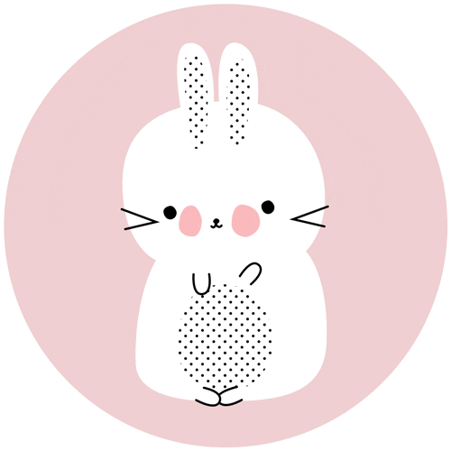
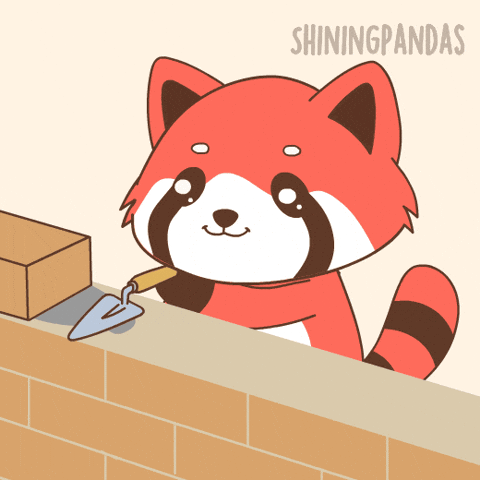
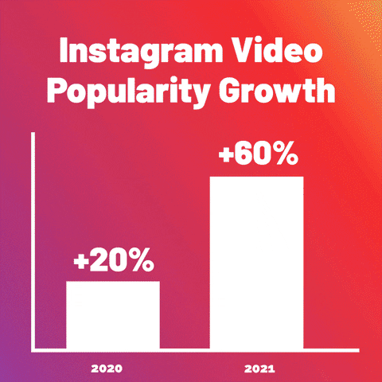
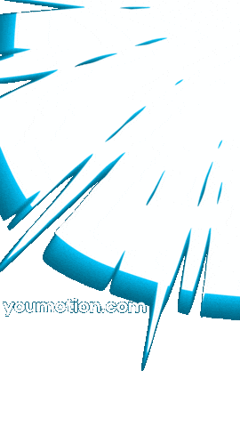

  
  
  
  
  

<picture>
  <source media="(prefers-color-scheme: dark)" srcset="https://raw.githubusercontent.com/Peter-JXL/Peter-JXL/output/github-contribution-grid-snake-dark.svg">
  <source media="(prefers-color-scheme: light)" srcset="https://raw.githubusercontent.com/Peter-JXL/Peter-JXL/output/github-contribution-grid-snake.svg">
  
</picture>

##  About Me

  

---

##  Tech Stack

  

---

##  Featured Projects

<table>
  <tr>
    <td width="50%">
      <h3 align="center">SrP-CFG_ForCS2</h3>
      

        <a href="https://github.com/RolinShmily/SrP-CFG_ForCS2">CS2 Config Manager</a>
      

      

        
        
        
      

      

        
      

    </td>
    <td width="50%">
      <h3 align="center">SrP-BloG</h3>
      

        <a href="https://github.com/RolinShmily/SrP-BloG">Personal Blog</a>
      

      

        
        
      

      

        
      

    </td>
  </tr>
  <tr>
    <td width="50%">
      <h3 align="center">SrP-IMG</h3>
      

        <a href="https://github.com/RolinShmily/SrP-IMG">Image Hosting Service</a>
      

      

        
        
      

    </td>
    <td width="50%">
      <h3 align="center">20-Fruit Recognition</h3>
      

        <a href="https://github.com/RolinShmily/20-Fruit_Recognition_System">Fruit Classification System</a>
      

      

        
        
      

    </td>
  </tr>
</table>

---

##  GitHub Stats

  
  &nbsp;&nbsp;
  

  

---

##  Blog Stats

  
  

---

##  Activity Graph

  <picture>
    <source media="(prefers-color-scheme: dark)" srcset="https://raw.githubusercontent.com/RolinShmily/RolinShmily/output/github-contribution-grid-snake-dark.svg" />
    <source media="(prefers-color-scheme: light)" srcset="https://raw.githubusercontent.com/RolinShmily/RolinShmily/output/github-contribution-grid-snake.svg" />
    
  </picture>

---

  

  

