### Hi there 👋, I'm RoL1n!
**An Electronic Information Engineering undergraduate.**

  
<b>🛠️ Tech Stack</b>

   
  

### 🧐 What I'm doing now
- ✏️ **Writing something on my blog:** [blog.srprolin.top](https://blog.srprolin.top/)
- 🎸 **Playing guitar & sharing tabs:** [sheet.srprolin.top](https://sheet.srprolin.top/)
- 🤖 **Using & sharing awesome skills:** [skill.srprolin.top](https://skill.srprolin.top/)

### 📊 GitHub Stats

---

  

  <picture>
    <source media="(prefers-color-scheme: dark)" srcset="https://raw.githubusercontent.com/RolinShmily/RolinShmily/output/github-contribution-grid-snake-dark.svg" />
    <source media="(prefers-color-scheme: light)" srcset="https://raw.githubusercontent.com/RolinShmily/RolinShmily/output/github-contribution-grid-snake.svg" />
    
  </picture>

  

